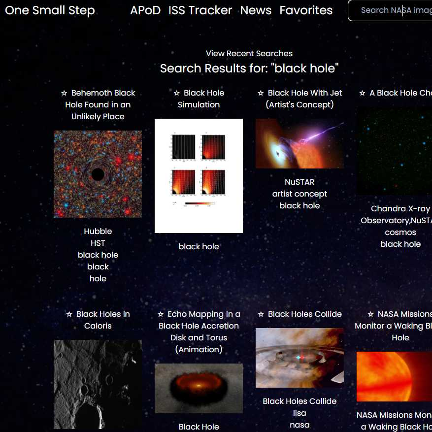

# One Small Step

## Description

One Small Step (stylized as 1SS) is meant to be a one-stop shop or resource hub for all lovers of astronomy, utilizing the significant public investment in NASA. Our first group project in the Vanderbilt Full-stack Coding Bootcamp taught us how to overcome challenges involving collaborating with Git as well as project management skills such as role delegation, Scrum meetings, and Kanban boards.

## Table of Contents

- [Features](#features)
- [Installation](#installation)
- [Usage](#usage)
- [Credits](#credits)
- [License](#license)

## Features

- Single-page application, no reloads or additional HTTP requests.
- Access to NASA's Astronomy Picture of the Day API using axios.
- Access to NASA's Image and Video Gallery API via user-submitted search queries.
- An interactive map using the Leaflet.js library and API data from WhereTheISS.at.
- Favoriting of images and preference memory using localStorage.
- A mobile-responsive design with the Tailwind UI CSS framework.

## Installation

Clone the One Small Step repository in a CLI using the command `git clone` to download all source files.

## Usage

Upload HTML source code and all asset files to a hosting service such as GitHub Pages.

The landing page is hosted [here](https://branjames117.github.io/one-small-step/).

## Credits

Developed by [Brandon James Hoskins](https://github.com/branjames117), [Patrick Manning](https://github.com/pmanning901), [Brian Sales](https://github.com/salesbc), and [Nathan Helms](https://github.com/nathanhelms) for the Vanderbilt Coding Boot Camp, 2021, with assets from [FavIcon](https://favicon.io/), [FontAwesome](https://fontawesome.com/), [Miriam Espacio @ Pexels](https://www.pexels.com/@miriamespacio), and [Clker-Free-Vector-Images @ Pixabay](https://pixabay.com/users/clker-free-vector-images-3736/).

## License

Creative Commons Zero v1.0 Universal
